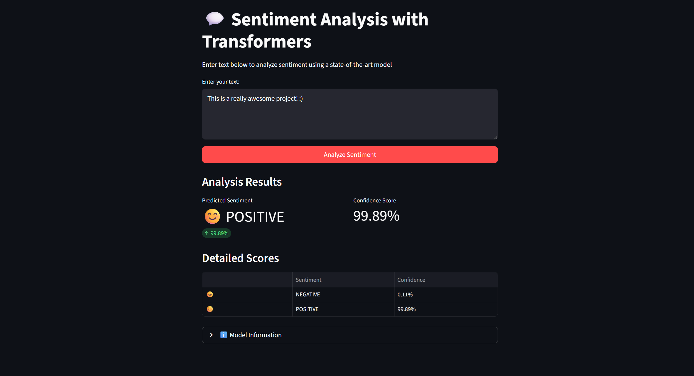

# 💬 Streamlit + Hugging Face Sentiment Analysis

A simple Streamlit web app that performs **sentiment analysis** using a **Hugging Face Transformers** model.

## 🌐 Online Demo

Try it directly on Hugging Face Spaces:  
👉 [**Sentiment Analysis App**](https://huggingface.co/spaces/crurbina97/sentiment-analysis)

### 🪄 Usage

- Enter any text or prompt in the input box.  
- Click **"Analyze Sentiment"** to see the model’s prediction.  
- The app shows:
  - The predicted sentiment (😊 Positive / 😞 Negative / 😐 Neutral)
  - Confidence scores for each class
  - A detailed results table with emojis

 

## ⚙️ Installation

For faster computation times, you can install the project locally using the following commands.

```bash
cd sentiment-analysis
python -m venv venv
source venv/Scripts/activate  # or on macOS/Linux: source venv/bin/activate
pip install -r requirements.txt
```

## 🚀 Run Locally

Activate the virtual environment and start Streamlit:

```bash
source venv/Scripts/activate
streamlit run src/streamlit_app.py
```

Then open the link shown in your terminal (usually `http://localhost:8501`).


## 🧰 Tech Stack

- [Streamlit](https://streamlit.io) — interactive UI  
- [Hugging Face Transformers](https://huggingface.co/transformers) — NLP models  
- [PyTorch](https://pytorch.org) — model backend  
- [Pandas](https://pandas.pydata.org) — data formatting  
- [Plotly](https://plotly.com) — visualizations  
- [Docker](https://www.docker.com/) — containerization for deployment

## ⚠️ Disclaimers

* This project **used code from Codecademy**: [Hugging Face with Streamlit App](https://www.codecademy.com/article/hugging-face-with-streamlit-app).

* This project exists **purely for educational purposes** and is not intended for commercial use.

* Portions of this project structure were **assisted by ChatGPT** for clarity and organization.